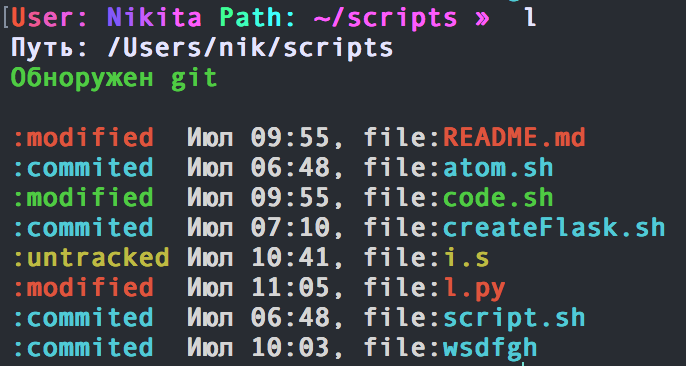

# scripts

реп куда я выкладываю свои скрипты 

> для того что бы сделать файл испольнительным нужно:

```sh
chmod +x file_name
```

#### Что к чему:


| Файл | Что он делает |
| ------ | ------ |
| .zshrc | тут всё понятно |
| atom.sh | для открытии файлов в Atom |
| code.sh | для открытии файлов в VS Code |
| script.sh | просто так |
| createFlask.sh | создаёт файл для сервера |
| l.py | показывает имя/дата создания/и гит статус файлов в каталоге|
| gca.py | клонирует все репозитории определённого пользователя|
| mt.py | сортирует файлы .png/jpg/py и тд по папкам |


---
- ## l.py:

Для того что бы оно заработало в .zshrc/.bashrc нужно ввести 
```sh
alias l='путь/до/l.py'
```

### как пользоватся:

- для просмотра файлов просто вводим:
```sh
l
```
- что бы посмотреть скрытые файлы:
```sh
l -a
```

### Программка l в папке где есть git 
- 

### Программка l в папке где нет git
- 
---


- ## gca.py:
> Скрипт который клонирует все публичные репозитории аккаунта github 

для просмотра файлов просто вводим:
```sh
python3 ./путь/до/gca.py
```
> а затем нужно ввести username гита

> все репозитории будут склонированны в папку с username'ом 

```sh
├── username
│   ├── repo1
│   └── repo1

```

## mt.py:
> Скрипт который сортирует файлы по типо png/jpg/py/js и так далее по папкам название которые соответсвуют их расширением например файлы python будут в папке py

```sh
├── py
│   ├── index.py
│   └── db.py
├── js
│   ├── index.js
│   └── connect.js
├── png
│   ├── photo.png
│   └── screenshot.png

```


для сортировки нужно запустить скрипт в папке в которой нужно отсортировать файлы например:

```sh
python3 ./путь/до/mt.py
```

> все файлы будут отсортированны 